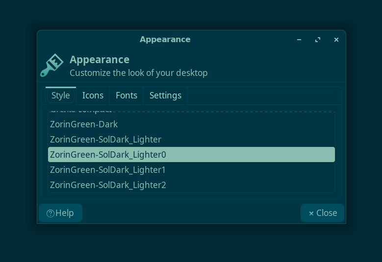
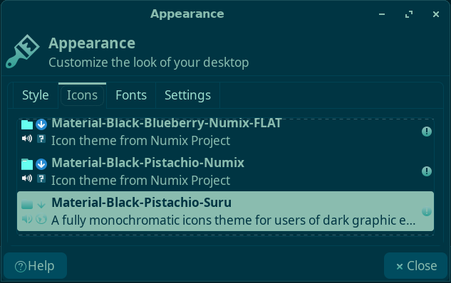
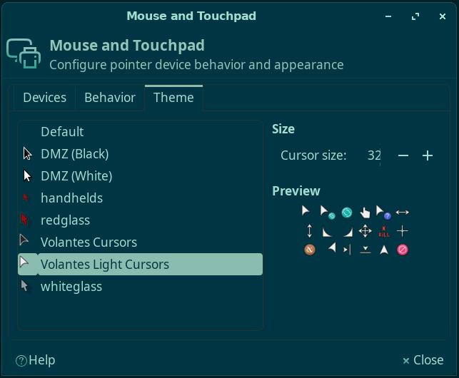
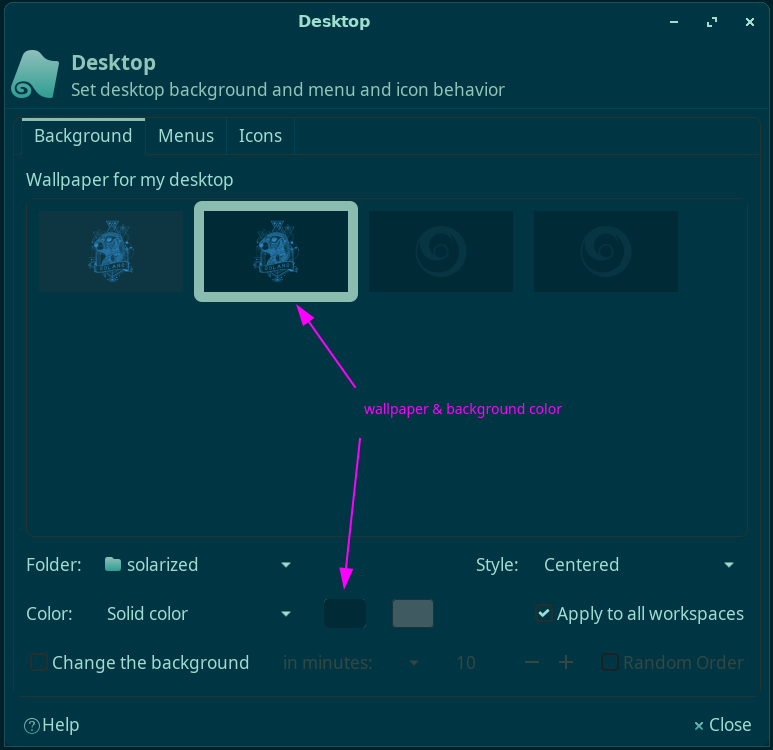

# My XFCE Design

The main background color that is used in most of the places is `#002B36`.

<br/>

## Theme

Starting based on Zorin Green theme, customized to my liking (colors, shadows, roundness) and `ZorinGreen-SolDark_Lighter0` remains my preferred choice for the last months, at least.

Such a theme must exists in `~/.themes` directory:<br/>
`cp -r dot_themes/ZorinGreen-SolDark_Lighter0 ~/.themes/`

Set on _Appearance_ (this screenshot includes also the window shadow and some part of the wallpaper):


<br/>

## Icons

Using [Material Black](https://www.xfce-look.org/p/1333360/) Pistachio Suru flavor for icons.

Saved here in `dot_icons` directory, and this needs to exist on `~/.icons` directory. So:<br/>
`cp dot_icons/Material-Black-Pistachio-Suru ~/.icons/`

Set on _Appearance_:



<br/>

## Cursor

The cursor theme is _Volantes Light Cursors_.

Saved here in `dot_icons` directory, this needs to exists on `~/.icons` directory. So:<br/>
`cp -r dot_icons/volantes_light_cursors ~/.icons/`

Set on _Mouse and Touchpad_:



<br/>

## Wallpaper

The wallpaper used is `solarized-golang_std_bg.png`. Stored here in `wallpapers` directory.

Set in _Desktop_:



<br/>


## IDEs

Also, for a complete user experience, included some IDEs customizations to the current design/setup.

### VSCode

Saved in `./IDEs/vscode`:
- `settings.json` file that includes the my customizations to the existing _Community Material Theme_
- `keybindings.json` file that has my currently preferred shortcuts (that mostly mimick the previous macOS experience)

<br/>

## XFCE

This section includes additional XFCE specific settings.

### Panel

I am using a vertical panel: in _Panel Preferences_, set "mode: Deskbar".<br/>
Besides this, a couple of CSS driven customizations were added to `~/.config/gtk-3.0/gtk.css` file:

```css
#xfce4-notification-plugin * { -gtk-icon-transform: scale(.6); }

#xfce4-power-manager-plugin * { -gtk-icon-transform: scale(.6); }

#pulseaudio-button * { -gtk-icon-transform: scale(.6); }

#clock-button { font-family: "Antonio"; font-size: 19px; color: #60e6b1 }

/* TBD: Although works on another Xubuntu, on the desktop the bottom line is still present.
tasklist button:checked {
  border: 0px;
  border-right: 1px solid #52c498;
}
*/

/* Alt+Tab window (but I don't think it's working) */
#xfwm-tabwin {
   -XfwmTabwinWidget-icon-size: 96px;
   -XfwmTabwinWidget-preview-size: 64px;
}
```

<br/>

